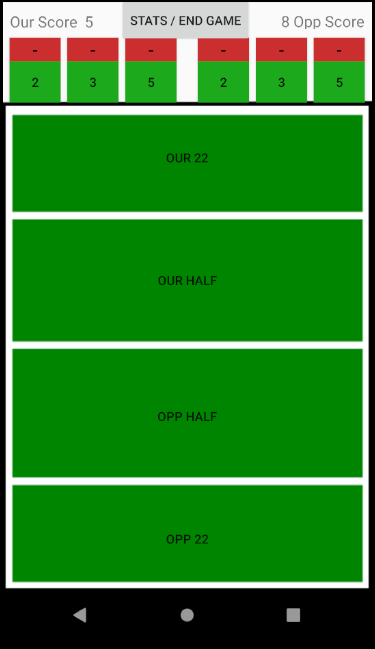
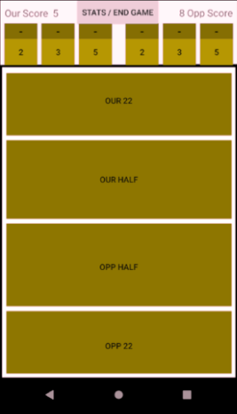
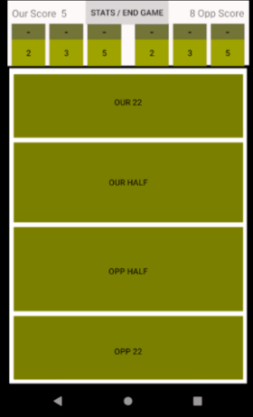
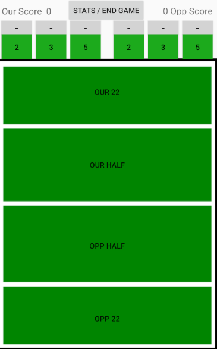
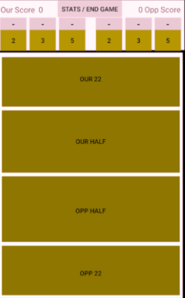

Accessibility Test
=============
 *  With User testing and UI testing complete we still felt that these test wern't thourogh enough. THey didn't account for  
    the 5% of the population that are colour blind.
 
 * We did some research and found that when red and green used in the same display, it can be extremely harsh on people with color blindess. 
   We soon realised that we had to modify our stats taking page, as red and green are the two prominent colours. This would make for 
   difficult / unappealing viewing for people with Protanopia or deuteranopia (green and/or red color blindness). We used a website (toptal) to  
   simulate the color blind colours on our app's activity. 
   

  

----Original---------------------------------------Deataranopia----------------------------------Protanopia

* Although we had symbols to indicate the subtract score, we still felt these colors could come accross unappealing or even confusing 
  for someone sufferring from colour blindness. To solve this problem, we changed the colour red, to a light grey. 
 
  

----Original---------------------------------------Deataranopia----------------------------------Protanopia
 

*  The results on Toptal, proved that the changes made were a lot more friendly to those suffering with colour blindness.

</main>

