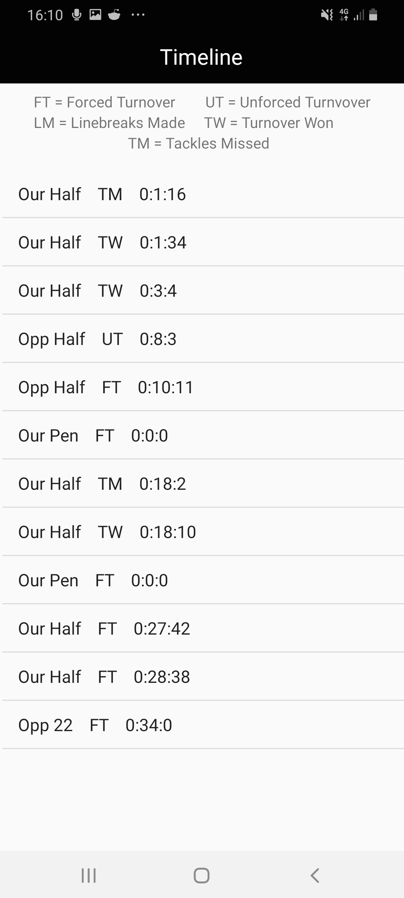
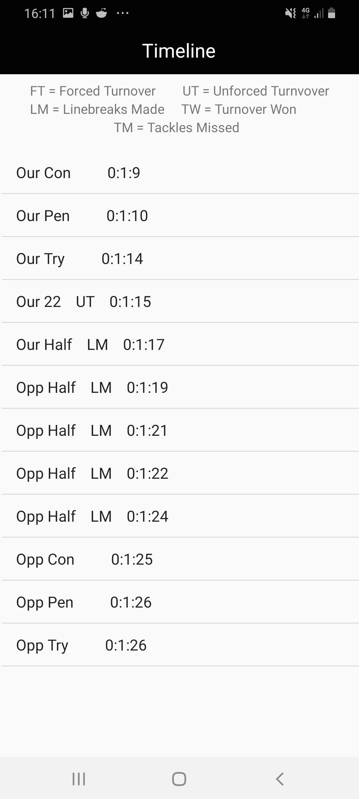

Match Test
=============
 *  After various testing methods we realised that we testing a full game ourselves would be a great chance to  
  come accross bugs that we wouldn't encounter otherwise.  

 * We both arrange to meet up and used the Scotland vs France game as a test. Andrew would record stats for the first 
   half, and I (Conor) would record stats for the second half.

* We were please to see that the game ran smoothly on both devices, without any major problems. It did open our eye to one 
  bug however. We notices that or penalties weren't being accounted for properly on the timeline as shown 
 below. 

 

*  We went to the location of the code where the penalties were being pushed to the database. We soon realised that this was 
  a quick fix. The computation of subtracting the start time from the current time wasn't set up correctly for this method.We had 
  the program back up and running in a few minutes with our updated code. Here was the expected output, that we achieved. 

</main>

